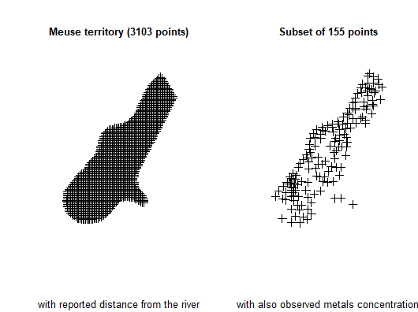

```{r setup, include=FALSE}
options(width = 999)
knitr::opts_chunk$set(echo = TRUE, fig.width=6, fig.height=4)
```


# Optimization with the *spatial* method

Let us suppose we want to design a sample survey with $k$ $Z$ target variables, each one of them correlated to one or more of the available $Y$ frame variables. 

When frame units are georeferenced or geocoded, the presence of spatial auto-correlation can be investigated. This can be done by executing for instance the Moran test on the target variables: if the null hypothesis is rejected (i.e. the hypothesis of the presence of spatial auto-correlation is accepted) then we should take into account also this variance component.

As indicated by @degruijter2016 and @degruijter2019, in case $Z$ is the target variable, omitting as negligible the *fpc* factor, the sampling variance of its estimated mean is:

\begin{equation} \label{eq1}
V(\hat{\bar{Z}}) = \sum_{h=1}^{H}(N_{h}/N)^{2} S_{h}^{2}/n_{h}
\end{equation}

We can write the variance in each stratum $h$ as:

\begin{equation} \label{eq2}
S_{h}^{2} = \dfrac{1}{N_{h}^{2}} \sum_{i=1}^{N_{h-1}}\sum_{j=i+1}^{N_{h}}(z_{i}-z_{j})^{2}
\end{equation} 

The optimal determination of strata is obtained by minimizing the quantity $O$:

\begin{equation} \label{eq3}
O = \sum_{h=1}^{H} \dfrac{1}{N_{h}^{2}} \{ \sum_{i=1}^{N_{h-1}}  \sum_{j=i+1}^{N_{h}} (z_{i}-z_{j})^{2}\}^{1/2}
\end{equation}

Obviously, values $z$ are not known, but only their predictions, obtained by means of a regression model. So, in Equation \ref{eq3} we can substitute $(z_{i}-z_{j})^{2}$ with 

\begin{equation} \label{eq5}
D_{ij}^{2} = \dfrac{(\tilde{z}_{i}-\tilde{z}_{j})^{2}}{R^{2}} + V(e_{i}) + V(e_{j}) - 2Cov(e_{i},e_{j})
\end{equation}

where $R^{2}$ is the squared correlation coefficient indicating the fitting of the regression model, and $V(e_{i})$, $V(e_{j})$ are the model variances of the residuals. The spatial auto-correlation component is contained in the term $Cov(e_{i},e_{j})$.

In particular, the quantity $D_{ij}$ is calculated in this way:

\begin{equation} \label{eq6}
D_{ij}^{2} = \dfrac{(\tilde{z}_{i}-\tilde{z}_{j})^{2}}{R^{2}} + (s_{i}^{2} + s_{j}^{2}) - 2 s_{i}  s_{j}  e^{-k (d_{ij}/range)}
\end{equation}

where $d_{ij}$ is the Euclidean distance between two units i and j in the frame (calculated using their geographical coordinates, that must be expressed in meters), the $s_{i}$ and $s_{j}$ are estimates of the prediction errors in the single points and *range* is the maximum distance below which spatial auto-correlation can be observed among points. The value of *range* can be determined by an analysis of the spatial *variogram*.


To summarize, when frame units can be geo-referenced, the proposed procedure is the following:

* acquire coordinates of the geographic location of the units in the population of interest;
*	fit a *kriging* model (or any other spatial model) on data for each $Z$;
* obtain predicted values together with prediction errors for each $Z$ and associate them to each unit in the frame;
* perform the optimization step.

In order to illustrate the "*spatial*" method, we make use of a dataset generally employed as an example of spatially correlated phenomena (in this case, the concentration of four heavy metals in a portion of the river Meuse). This dataset comes with the library "*sp*":

```{r, eval = FALSE, echo=TRUE, message=FALSE}
library(sp)
# locations (155 observed points)
data("meuse")
# grid of points (3103)
data("meuse.grid")
meuse.grid$id <- c(1:nrow(meuse.grid))
coordinates(meuse)<-c("x","y")
coordinates(meuse.grid)<-c("x","y")
lm_lead <- lm(log(lead) ~ dist,data=meuse)
lm_zinc <- lm(log(zinc) ~ dist,data=meuse)
```

```{r, eval = FALSE, echo=FALSE, include=FALSE}
par(mfrow=c(1,2))
plot(meuse.grid)
title("Meuse territory (3103 points)",sub="with reported distance from the river",cex.main=0.8,cex.sub=0.8)
plot(meuse)
title("Subset of 155 points",sub="with also observed metals concentration",cex.main=0.8,cex.sub=0.8)
par(mfrow=c(1,1))
```




We analyse the territorial distribution of the *lead* and *zinc* concentration, and model (by using the *universal kriging*) their relations with distance from the river, using the subset of 155 points on which these values have been jointly observed: 

```{r, eval = FALSE,echo=TRUE,message=FALSE,fig.width=6,fig.height=8}
library(automap)
kriging_lead = autoKrige(log(lead) ~ dist, meuse, meuse.grid)
plot(kriging_lead,sp.layout = NULL, justPosition = TRUE)
```


```{r, eval = FALSE,echo=TRUE,message=FALSE,fig.width=6,fig.height=8}
kriging_zinc = autoKrige(log(zinc) ~ dist, meuse, meuse.grid)
plot(kriging_zinc, sp.layout = list(pts = list("sp.points", meuse)))
```


Using these *kriging* models, we are able to predict the values of lead and zinc concentration on the totality of the 3,103 points in the Meuse territory:

```{r, eval = FALSE,echo=TRUE}
df <- NULL
df$id <- meuse.grid$id
df$lead.pred <- kriging_lead$krige_output@data$var1.pred
df$lead.var <- kriging_lead$krige_output@data$var1.var
df$zinc.pred <- kriging_zinc$krige_output@data$var1.pred
df$zinc.var <- kriging_zinc$krige_output@data$var1.var
df$lon <- meuse.grid$x
df$lat <- meuse.grid$y
df$dom1 <- 1
df <- as.data.frame(df)
head(df)
#   id lead.pred  lead.var zinc.pred  zinc.var    lon    lat dom1
# 1  1  5.509360 0.1954937  6.736502 0.2007150 181180 333740    1
# 2  2  5.546006 0.1716895  6.785460 0.1749260 181140 333700    1
# 3  3  5.488913 0.1784052  6.698883 0.1826314 181180 333700    1
# 4  4  5.388320 0.1855561  6.558216 0.1906426 181220 333700    1
# 5  5  5.584415 0.1463018  6.841612 0.1465346 181100 333660    1
# 6  6  5.525538 0.1533757  6.749216 0.1549663 181140 333660    1
```

The aim is now to produce the optimal stratification of the 3,103 points under a precision constraint of 1% on the target estimates of the mean *lead*  and *zinc* concentrations:

```{r, eval = FALSE,echo=TRUE, message=FALSE, warning=FALSE}
library(SamplingStrata)
frame <- buildFrameSpatial(df=df,
                      id="id",
                      X=c("lead.pred","zinc.pred"),
                      Y=c("lead.pred","zinc.pred"),
                      variance=c("lead.var","zinc.var"),
                      lon="lon",
                      lat="lat",
                      domainvalue = "dom1")
#  id       X1       X2       Y1       Y2      var1      var2    lon    lat domainvalue
# 1  1 5.509360 6.736502 5.509360 6.736502 0.1954937 0.2007150 181180 333740           1
# 2  2 5.546006 6.785460 5.546006 6.785460 0.1716895 0.1749260 181140 333700           1
# 3  3 5.488913 6.698883 5.488913 6.698883 0.1784052 0.1826314 181180 333700           1
# 4  4 5.388320 6.558216 5.388320 6.558216 0.1855561 0.1906426 181220 333700           1
# 5  5 5.584415 6.841612 5.584415 6.841612 0.1463018 0.1465346 181100 333660           1
# 6  6 5.525538 6.749216 5.525538 6.749216 0.1533757 0.1549663 181140 333660           1
```


```{r, eval = FALSE,echo=TRUE, message=FALSE, warning=FALSE}
cv <- as.data.frame(list(DOM=rep("DOM1",1),
                         CV1=rep(0.01,1),
                         CV2=rep(0.01,1),
                         domainvalue=c(1:1) ))
cv
#    DOM  CV1  CV2 domainvalue
# 1 DOM1 0.01 0.01           1
```

To this aim, we carry out the optimization step by indicating the method *spatial*:

```{r, eval = FALSE,echo=TRUE, message=FALSE, warning=FALSE}
set.seed(1234)
solution <- optimStrata (
  method = "spatial",
  errors=cv, 
  framesamp=frame,
  iter = 15,
  pops = 10,
  nStrata = 5,
  fitting = c(summary(lm_lead)$r.square,summary(lm_zinc)$r.square),
  range = c(kriging_lead$var_model$range[2],kriging_zinc$var_model$range[2]),
  kappa=1)

# *** Domain :  1   1
#  Number of strata :  3103
# GA Settings
#   Population size       = 10
#   Number of Generations = 15
#   Elitism               = 2
#   Mutation Chance       = 0.111111111111111
# 
# 
# 
#  *** Sample cost:  79.87774
#  *** Number of strata:  4
#  *** Sample size :  80
#  *** Number of strata :  4
# ---------------------------

```


obtaining the following optimized strata:

```{r, eval = FALSE,echo=TRUE}
plotStrata2d(solution$framenew,
             solution$aggr_strata,
             domain=1,
             vars=c("X1","X2"),
             labels=c("Lead","Zinc"))
```


that can be visualised in this way:

```{r, eval = FALSE,echo=TRUE}
frameres <- SpatialPointsDataFrame(data=framenew, coords=cbind(framenew$LON,framenew$LAT) )
frameres2 <- SpatialPixelsDataFrame(points=frameres[c("LON","LAT")], data=framenew)
frameres2$LABEL <- as.factor(frameres2$LABEL)
spplot(frameres2,c("LABEL"), col.regions=bpy.colors(5))
```


We can now proceed with the selection of the sample:

```{r, eval = FALSE,echo=TRUE}
s <- selectSample(solution$framenew,
                  solution$aggr_strata)

# *** Sample has been drawn successfully ***
#  80  units have been selected from  4  strata
```

whose units are so distributed in the territory:

```{r, eval = FALSE,echo=FALSE,message=FALSE,fig.width=6, fig.height=8}
plot(s$LON[s$LABEL==1],s$LAT[s$LABEL==1],col="black",
     xlab="longitude",ylab="latitude",
     xlim=c(min(s$LON),max(s$LON)),
     ylim=c(min(s$LAT),max(s$LAT)))
text(s$LON[s$LABEL==1],s$LAT[s$LABEL==1], labels = row.names(s[s$LABEL == 1,]), pos = 2, cex=0.6)
points(s$LON[s$LABEL==2],s$LAT[s$LABEL==2],col="blue")
text(s$LON[s$LABEL==2],s$LAT[s$LABEL==2], labels = row.names(s[s$LABEL == 2,]), pos = 4, cex=0.6, col="blue")
points(s$LON[s$LABEL==3],s$LAT[s$LABEL==3],col="magenta")
text(s$LON[s$LABEL==3],s$LAT[s$LABEL==3], labels = row.names(s[s$LABEL == 3,]), pos = 3, cex=0.6, col="darkorange")
points(s$LON[s$LABEL==4],s$LAT[s$LABEL==4],col="darkorange")
text(s$LON[s$LABEL==4],s$LAT[s$LABEL==4], labels = row.names(s[s$LABEL == 4,]), pos = 1, cex=0.6, col="yellow")
# points(s$LON[s$LABEL==5],s$LAT[s$LABEL==5],col="red")
# text(s$LON[s$LABEL==5],s$LAT[s$LABEL==5], labels = row.names(s[s$LABEL == 5,]), pos = 4, cex=0.6, col="red")
title("Selected units")

```


# References